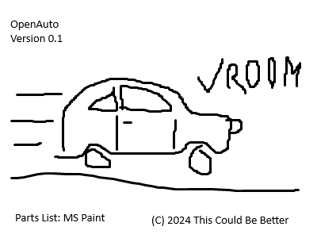

Open Source Automobile
======================

This repository is intended to house open-source designs for various models of automobile.

These designs may be freely used and adapted under the terms of the MIT license.  Unless
specifically noted, these designs are for research purposes only, and are not intended to
be driven, especially on public roads.  No guarantee of the safety and efficacy of these
designs is offered or implied.

Indeed, as of this writing, the only design is an MS Paint drawing, so that should really
go without saying.  If things go well, it is intended to add a macaroni-box, rubber-band
and push-up-sherbet-plunger model within the year, and after that maybe a Lego version.
After that, we start pouring steel!  Or gluing popsicle sticks.  We haven't decided.

